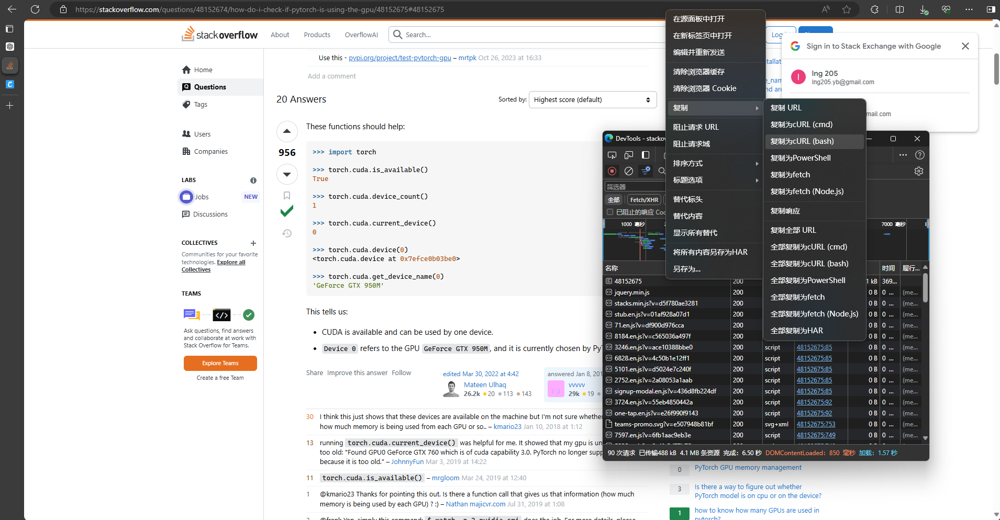

Chinese version: [README_CN.md](README_CN.md)

# StackOverflow Scraper

This is a general web scraper framework designed to extract questions and answers from the StackOverflow website. It uses the BeautifulSoup library to parse HTML and extract the necessary information.

## Installation

1. Clone the repository:
   ```bash
   git clone <repository-url>
   ```
2. Install the required packages:
   ```bash
   pip install -r requirements.txt
   ```

## Usage

### Step 1: Scrape

The first step involves scraping web pages and saving them locally to avoid multiple requests to the website, which could result in being blocked.

#### Obtain Initial Cookies

1. Visit the StackOverflow website and log in.
2. Navigate to the target page and inspect the network requests using the browser developer tools (F12).
3. Extract the request cookies and headers from the browser.

   One method to extract the cookies:
   
   - Paste the cURL command to [curlconverter.com/python](https://curlconverter.com/python/)
   - Save the cookies in the `initial_cookies` variable in the `scrape.py` file.

#### Scrape Questions

1. Uncomment the following line in the `scrape.py` file:
   ```python
   scrape_questions(initial_cookies, headers, range(1, 200), 'pytorch')
   ```
   - `range` specifies the range of pages to scrape.
   - `'pytorch'` is the query to search for.

2. Run the scraper:
   ```bash
   python scrape.py
   ```

3. The scraped data will be saved in the `pages` folder.

#### Scrape Contents

1. Uncomment the following line in the `scrape.py` file:
   ```python
   scrape_contents(initial_cookies, headers)
   ```

#### Handling Being Blocked

- If you receive a response code 429, change your IP address using a proxy.
- If you encounter a CAPTCHA, solve it manually and update the cookies and headers.

### Step 2: Parse

The second step is to parse and extract the required information from the saved responses.

1. Run the parser:
   ```bash
   python parse.py
   ```

2. The parsed data will be stored in a SQL database for further analysis.

### Step 3: Export

The final step is to export the parsed data to a CSV file for easy access and sharing.

1. Run the exporter:
   ```bash
   python export.py
   ```


### Recommend Staring Flow

1. Scrape the first 10 pages of questions
2. Parse the questions and save them to a database
3. Scrape the contents of the questions
4. Parse the contents and save them to a database
5. Export the parsed data to a CSV file