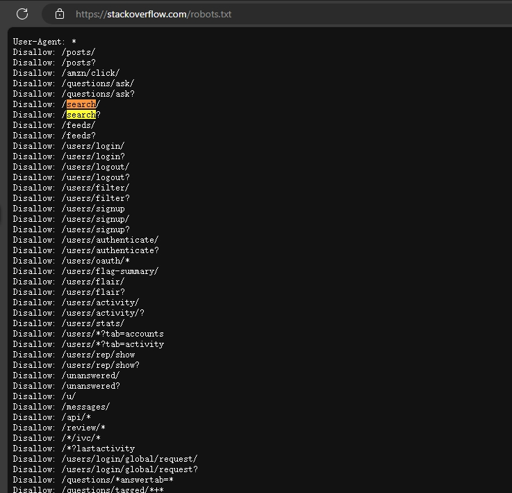
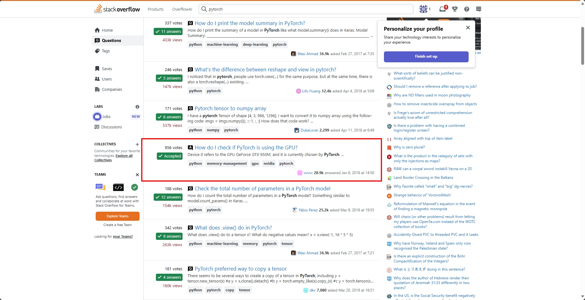

# Devlog

- The search route is disallowed in robot.txt

Use the scraper and data carefully and respectfully!

- There would be CAPTCHA. Solve the CAPTCHA manually, extract the curl command and [convert](https://curlconverter.com/python/). 

- Log in would provide more search results. This also seems to be less likely to cause CAPTCHA.

- Some questions don't have stats and will be discarded.

The cookies will change on every request. We need to modify our cookies based on the response.

- Stackoverflow may block ip even after dynamic cookies and random sleep time.
If getting "Just a moment..." in response title, it means the IP is blocked. Change ip using proxy.

- StackoverFlow provides an [api](https://stackoverflow.co/api-solutions/) for LLM purposes. However, it is only provided for its cooperation partners.
- Some pages has been removed from the search results. We need to handle this case.